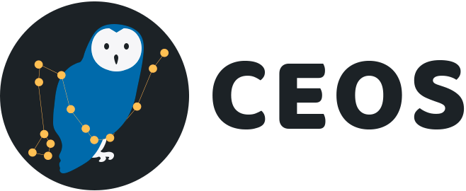

# 

Organize seus estudos, criando matérias e gerenciando suas atividades, além de criar o seu próprio cronograma.
> Este projeto foi feito para a conclusão do curso técnico de Informática para Internet na Etec Lauro Gomes

## O que foi usado

Para a parte do backend, as principais tecnologias usadas foram:

- NodeJS
- Typescript
- MongoBD (com Mongoose)

Já para a parte do frontend, foram utilizados:

- React
- Javascript
- Sass
- Bootstrap

> Varios outros pacotes, gerenciados com yarn.

## Como usar

Primeiramente, tenha certeza de que tem os seguintes programas: 

- NodeJS _(feito com a versão 14.17.6, mas versões mais atuais devem funcionar)_
- Git
- Yarn

Depois, clone o repositório.  
Instale as dependencias com `yarn install`, faça isso na pasta `client` e na pasta `api`.  
Crie o arquivo `.env` na pasta `api`, o arquivo `.env-model` serve como exemplo.  
> Note que se você mudar a porta do servidor backend, sera necessário modificar as chamadas utilizadas pelo frontend.

> Se você colocar uma conta gmail no arquivo `.env`, é necessário ativar o acesso a aplicativos menos seguros  
> E também é necessario desativar a autenticação de dois fatores para a conta utilizada  

Agora basta iniciar o programa.  
1. Em `api`, use o comando `yarn dev`  
2. Em `client`, use o comando `yarn start`

Na pasta `client`, Você também pode utilizar `yarn build` para fazer uma build de produção, e servi-la com o servidor de sua escolha.
